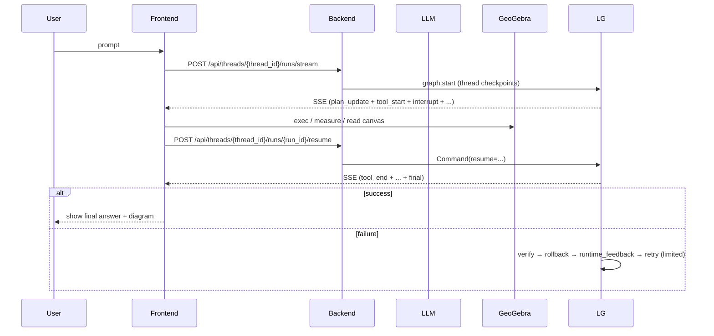

## Prompt System (v2): GeoGebraTutor

v2 uses a **file-based prompt system** and composes prompts **per node** (plan / command-gen / final / memory).

Goals:
- Keep prompts editable without touching code logic
- Centralize GeoGebra environment constraints
- Reuse scenario playbooks (triangle angle sum / parallel lines / Pythagoras / …)
- Keep “文字输出零包装”原则：自然语言由 LLM 自己生成（见 `docs/spec/prompt-contract.md`）

### Prompt composition (v2)

**Command generation (commands only)** — used by `generate_geogebra_commands`:
1. `prompts/v2/command_gen_system.md`
2. `prompts/geogebra-constraints.md`
3. `prompts/packs/draw.md` or `prompts/packs/repair.md` (chosen by whether runtime_feedback exists)
4. All `prompts/scenarios/*.md` (sorted by filename)
5. `prompts/commandbook.json` (reference)

**Final answer (text only)** — used by `generate_final_answer`:
- `prompts/v2/final_system.md`

**Plan (optional, UI)** — used by `generate_plan`:
- `prompts/v2/plan_system.md`

**Conversation memory summarization** — used by `summarize_memory`:
- `prompts/v2/memory_summary_system.md`

### LLM Context Pack (v2)

为减少“谁画的/是否自动生成”等归因幻觉，v2 在每轮调用 LLM 时会提供一份**结构化证据包**（而不是把 UI Timeline 原样塞进 prompt）。

当前（2026-01-01）会注入的核心字段包括：
- `memory_summary`：对话摘要（短）
- `recent_messages`：最近 N 条对话（截断）
- `canvas_objects`：最新画板对象摘要（最多 12 个；name/type/value/definition/visible）
- `canvas_object_type_counts`：画板对象类型计数（circle/point/polygon/…）
- `action_ledger`：最近 M 次**会改变画板**的工具动作摘要（主要是 `exec_geogebra_commands` / `delete_objects`），含：
  - `run_id` / `tool_name` / `ok`
  - `created_objects` / `deleted_objects`
  - （失败时）`failed_count` / `failed_preview` / `rolled_back_objects` / `rollback_errors_count`
  - `commands_preview`（仅预览，避免过长）
- `object_provenance`：对象归因表（仅针对 `canvas_objects` 中出现的对象）：
  - `name -> created_by_run_id | unknown`
- `canvas_diff`（可选）：上一轮快照 → 当前快照的差分（new/removed/changed）

实现位置：
- 后端注入：`apps/api/app/llm_decider.py`
- 工具结果写入 state：`apps/api/app/runtime_graph.py`（tool_results 带 `run_id`）

```mermaid
flowchart TD
  v2sys[prompts/v2/*.md] --> compose[ComposePerNodePrompt]
  packs[prompts/packs/*.md] --> compose
  constraints[prompts/geogebra-constraints.md] --> compose
  scenarios[prompts/scenarios/*.md] --> compose
  commandbook[prompts/commandbook.json] --> compose
  compose --> api[/api/threads/.../runs/stream]
```

### Runtime feedback loop (self-healing)



### Why this design
- **Maintainability**: system prompt is editable without touching code logic.
- **Robustness**: environment-specific command constraints are centralized.
- **Pedagogy**: scenarios encode kid-friendly explanations and reliable constructions.

### Files
- `prompts/geogebra-constraints.md`
- `prompts/v2/command_gen_system.md`
- `prompts/v2/final_system.md`
- `prompts/v2/plan_system.md`
- `prompts/v2/memory_summary_system.md`
- `prompts/packs/*.md`
- `prompts/scenarios/*.md`
- `prompts/commandbook.json`
