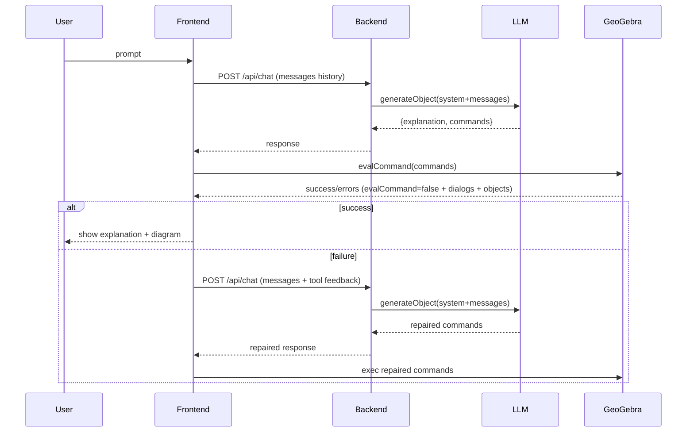

## Prompt System: GeoGebraTutor

This project uses a **file-based system prompt** that defines:
- Assistant role & interaction policy
- Output JSON contract
- Troubleshooting loop using GeoGebra runtime feedback
- GeoGebra environment constraints (supported/unsupported commands)
- Scenario playbooks (Pythagorean, parallel lines, triangle angle sum, …)

### Prompt composition

The server composes the final system prompt in this order:

1. `prompts/system.md`
2. `prompts/geogebra-constraints.md`
3. All `prompts/scenarios/*.md` (sorted by filename)

```mermaid
flowchart TD
  system[system.md] --> compose[ComposeSystemPrompt]
  constraints[geogebra-constraints.md] --> compose
  scenarios[scenarios/*.md] --> compose
  compose --> final[FinalSystemPrompt]
  final --> api[/api/chat]
```

### Runtime feedback loop (self-healing)



### Why this design
- **Maintainability**: system prompt is editable without touching code logic.
- **Robustness**: environment-specific command constraints are centralized.
- **Pedagogy**: scenarios encode kid-friendly explanations and reliable constructions.

### Files
- `prompts/system.md`
- `prompts/geogebra-constraints.md`
- `prompts/scenarios/pythagoras.md`
- `prompts/scenarios/parallel-line.md`
- `prompts/scenarios/triangle-angle-sum.md`


