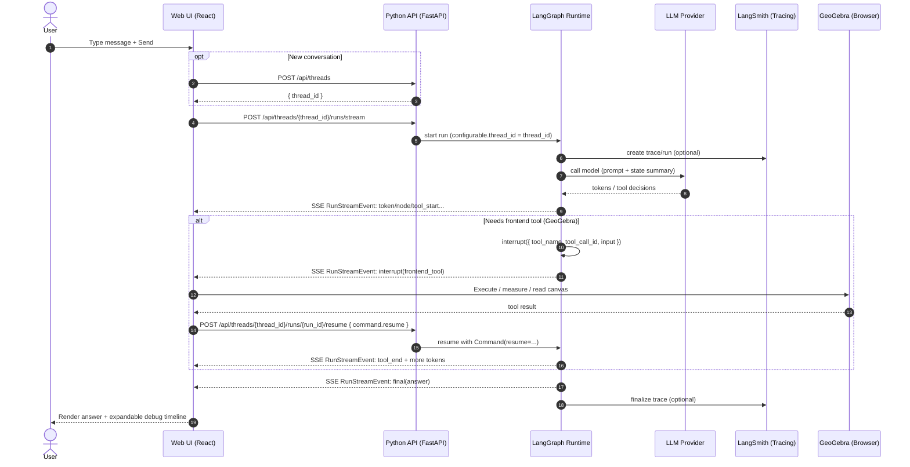
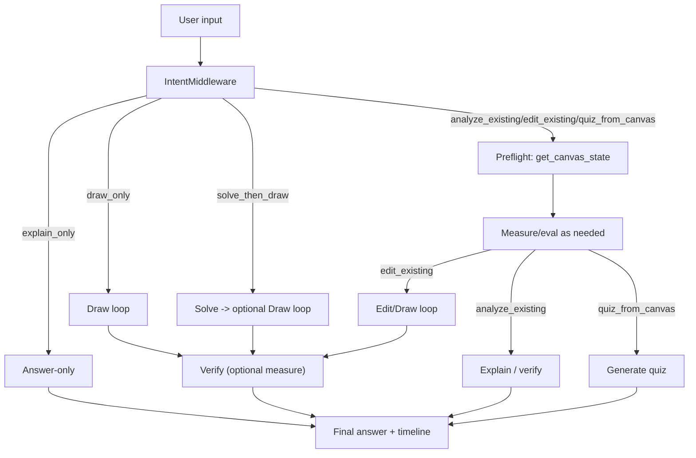
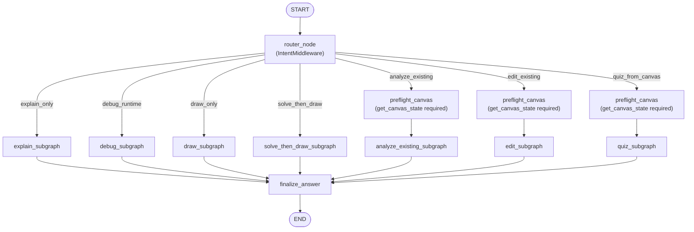

## Spec v2 — LangGraph/LangChain/LangSmith（Python 最佳实践；允许破坏兼容）

> 立场：当前产品仍是 POC，优先追求“更标准、更可观测、更易扩展、更接近官方推荐”的 agent runtime。  
> 因此本 spec **不要求兼容**现有 `/api/chat`/tool runner 协议；我们将以 LangGraph（Python）的 **threads/checkpoints + interrupts/resume + streaming** 为骨架，以 LangChain v1（Python）的 **create_agent + middleware** 为标准入口，以 LangSmith 为默认观测。

> 范围说明（避免与现有文档打架）：本文件描述 **目标态（v2）** 的新后端（thread/run + SSE + interrupts）。  
> 当前仓库内仍存在并正在运行的 **v1 `/api/chat` + tool runner（多轮 HTTP）** 协议；其详细契约见：  
> - `docs/spec/prompt-contract.md`（v1 输出契约与 tool runner）  
> - `docs/spec/tool-runner.md`（v1 工具闭环）  
> - `docs/spec/provider-adapter-contract.md` / `docs/spec/model-routing.md`（v1 多模型与 toolPolicy）  
> v2 实现落地后，这些文档会被同步升级或标记为 legacy。

---

## 0) 版本与依赖策略（先定死，避免写错版本）
POC 阶段建议 **pin 版本**（不要“永远最新版”），升级走小步回归。

建议基线（以 2025-12-30 的 PyPI 最新稳定版为准）：
- `python>=3.11`
- `langchain==1.2.0`（LangChain v1，含 `create_agent`）
- `langgraph==1.0.5`（LangGraph Python）
- `langsmith==0.5.2`（Tracing/threads 概念对齐）
- `fastapi==0.128.0` + `uvicorn==0.40.0`
- `sse-starlette==3.1.1`（SSE streaming）

> 备注：具体 lock 以我们后续引入 `pyproject.toml`/`uv.lock`/`poetry.lock` 为准；此处先作为设计文档的“选型锚点”。

当前落地（v2 API）：
- 默认 **stub**（未配置 key 时不会真实调用模型）
- 可选开启真实 LLM（OpenAI / OpenAI-compatible）：设置 `V2_LLM_API_KEY`（可选 `V2_LLM_BASE_URL`/`V2_LLM_MODEL`/`V2_LLM_TIMEOUT_S`）
- 或复用 v1 的 `LLM_ENDPOINTS_JSON`（仅支持 `provider=openai/openai-compatible`；优先 `LLM_AUTO_PREFERRED_ENDPOINT_ID`）
- 推荐：复用 v1 的 `LLM_MODEL_ALIASES_JSON` + `LLM_ROLE_BINDINGS_JSON`（v2 默认使用 role=`main`，可用 `V2_LLM_ROLE` 切换；当前仅支持 `provider=openai/openai-compatible`，role 若指向 `google` 会退回 stub）
- 或复用 v1 `.env.local`（默认尝试读取本 worktree 的 `.env.local`，以及 sibling v1 `../geogebra-ai-drawer/.env.local`；可用 `V2_ENV_FILE` 覆盖）
- 预算事件 `budget` 会同时包含 `tool_calls_*` 与（若启用）`model_calls_*`

---

## 1) 核心目标
1) **LangGraph-first**：后端用 graph runtime 表达 intent/plan/action/reflection/memory，而不是散落循环与 if/else。
2) **Durable state**：每个会话 thread 都有 checkpoints（支持 replay/fork/human-in-the-loop）。
3) **External-in-the-loop**：前端工具（GeoGebra）通过 interrupts 暂停与 resume，而不是“多轮 JSON 约定”。
4) **Streaming by default**：运行过程（tokens + node/tool events + interrupts）可实时流式输出到 UI。
5) **Observability-first**：LangSmith tracing 默认开启，可按 thread/run 回放与 RCA。

---

## 2) 推荐技术路线（Python 最佳实践）

### 2.1 Agent 标准入口：LangChain v1 `create_agent` + middleware
- 采用 LangChain v1 的 `create_agent()` 作为“写 agent 的标准入口”，通过 middleware 实现：
  - 动态 prompt / context engineering（按需注入，而不是每次重复堆 system）
  - tool 的按需暴露与强制策略（required tools 禁止 fallback）
  - summarization（压缩 history/tool results，避免 token 爆炸）
  - plan/todo（内部过程，UI 可折叠展示）
  - guardrails 与错误策略（失败不无限重试）
- 背景：LangChain v1 官方将 `create_agent` 作为标准方式，替代 `langgraph.prebuilt.create_react_agent`。

参考：
- https://docs.langchain.com/oss/python/releases/langchain-v1/index

### 2.2 Graph runtime：LangGraph Python（threads/checkpoints/interrupts/streaming）
我们使用 LangGraph Python 的核心能力：
- **threads/checkpoints/persistence**：把每次 super-step 的 state snapshot 写入 checkpointer（POC 默认 InMemory；需要 durability 时优先 PostgresSaver；SQLite 仅作为可选项/后续评估）。
- **interrupt/resume**：把“需要前端执行”的步骤转化为 interrupt，等待 UI 回填结果继续。
- **stream / stream_mode**：在服务端把运行过程映射为我们自己的 `RunStreamEvent` 事件流（UI 消费 SSE）。
- **durability**：必要时使用 `durability="sync"` 提高可恢复性（POC 可先 `async` 或默认）。

关键注意点（来自 LangGraph interrupts 语义）：
- `interrupt()` 是通过抛异常实现暂停；不要用裸 `try/except Exception` 包住它。
- 恢复时 **节点会从头重跑**；任何副作用必须是幂等，或封装进 `@task`（避免重复执行）。
- 一个节点中多个 `interrupt()` 的顺序必须稳定（不要条件跳过/循环产生动态数量）。

参考：
- Interrupts: https://docs.langchain.com/oss/python/langgraph/interrupts
- Streaming: https://docs.langchain.com/oss/python/langgraph/streaming
- Persistence: https://docs.langchain.com/oss/python/langgraph/persistence
- Durable execution: https://docs.langchain.com/oss/python/langgraph/durable-execution

### 2.3 API 层：FastAPI + SSE（EventSourceResponse）
为了让 UI 有“过程感”，我们默认走 SSE：
- `sse-starlette` 的 `EventSourceResponse` 输出事件
- 服务端每个 event 的 `data` 放 JSON（由前端解析渲染）
- 心跳/ping 处理代理断连

参考：
- https://github.com/sysid/sse-starlette

### 2.4 Observability：LangSmith（默认开启）
要求：thread/run/interrupt/tool events 都能在 trace 里回放，方便 RCA。

参考：
- https://docs.langchain.com/langsmith/observability-concepts

---

## 3) 新的外部协议（Breaking Change）
我们采用 **thread + run** 的交互模型（贴近 LangGraph 心智模型）。

### 3.1 关键标识
> 命名约定：对齐 LangGraph/LangChain Python 生态，协议字段默认用 `snake_case`；前端如需可在 UI 层映射到 `camelCase`。

- `thread_id`：一次会话的稳定 id（传给 checkpointer 的 `configurable.thread_id`）。
- `run_id`：一次运行（一次用户输入触发一个 run；期间可能 interrupt 多次）。
- `checkpoint_id`：每次保存的快照 id（用于 replay/fork）。

### 3.2 API（建议最小集合）
1) `POST /api/threads`
- response：`{ "thread_id": "..." }`

2) `POST /api/threads/{thread_id}/runs/stream`
- request：
```json
{
  "input": { "user_text": "..." },
  "ui_context": { "locale": "zh-CN", "debug": true, "plan_mode": false }
}
```
- response：SSE（事件为我们自定义的 `RunStreamEvent`；底层可来自 LangGraph `graph.stream(..., stream_mode=...)` 或 LangChain `astream_events`）

3) `POST /api/threads/{thread_id}/runs/{run_id}/resume`
- request（ToolResumePayload）：
```json
{
  "command": {
      "resume": {
      "tool_name": "get_canvas_state",
      "tool_call_id": "uuid",
      "ok": true,
      "output": { "any": "json" },
      "error": "optional (required when ok=false; can be string or object)"
    }
  }
}
```
- 服务端必须做一致性校验：`tool_call_id` + `tool_name` 必须与该 run 当前 pending tool 匹配；不匹配返回 **HTTP 409**（JSON detail，含 expected/got）
- 重复 `/resume`（同一个已完成的 `tool_call_id`）应是幂等的：服务端不重复推进状态，并可选择“重放最新 interrupt”帮助前端续跑
- response：继续 SSE（直到完成或再次 interrupt；因此一个 run 可能需要多次 `/resume`）

4) `GET /api/threads/{thread_id}/state`
- 返回 latest state snapshot（DebugPanel / time-travel）

5) `POST /api/threads/{thread_id}/state/update`（可选）
- 用于 human edit / fork：
```json
{ "checkpoint_id": "optional", "patch": { "...": "..." } }
```

6) `GET /api/schema/v2`（推荐；debug/对照用）
- 返回 v2 协议的 `protocol_version` 与核心 schema（`RunStreamEvent`/`ToolResumePayload`/tool io）用于前后端对照与排障

### 3.3 App 主交互过程（时序图）
下面这张图描述“用户一句话 → 后端开始 run（SSE）→ 必要时 interrupt 让前端执行 GeoGebra 工具 → resume → 输出 final”的完整闭环。



对应到我们协议的关键点：
- UI 永远以 `thread_id` 为会话主键；每次用户输入触发一个 `run_id`。
- 当后端需要浏览器侧能力（GeoGebra API）时，**必须**通过 `interrupt` 发出 `tool_call_id`，由 UI 去重执行后再 `/resume` 回填结果。
- UI 的“过程展示”来自 SSE 里的 `RunStreamEvent`，不是从最终文本里“猜”出来。

---

## 4) UI 与运行时事件（Streaming 事件流）
UI 不应该只能看到“thinking...”，而应能看到：
- model token stream（可节流）
- node start/end（哪个阶段在跑）
- tool start/end（调用了什么工具）
- interrupt request（前端工具请求）
- resume ack（前端结果返回）
- final answer（对孩子可见的解释）

事件格式建议（内部统一，不要求对齐 LangGraph 原生 event 名称；但要可映射）：
```ts
export type RunStreamEvent =
  | { event: 'run_start'; data: { run_id: string; thread_id: string; protocol_version?: string; llm_enabled?: boolean; llm_model?: string; llm_base_url?: string } }
  | { event: 'node_start'; data: { name: string } }
  | { event: 'plan_update'; data: { plan: Array<{ id: string; text: string; done?: boolean }> } }
  | { event: 'token'; data: { text_delta: string } }
  | { event: 'tool_start'; data: { tool_name: string; tool_call_id: string; input: any } }
  | { event: 'interrupt'; data: { kind: 'frontend_tool'; tool_name: string; tool_call_id: string; input: any } }
  | { event: 'tool_end'; data: { tool_name: string; tool_call_id: string; output: any; ok: boolean; error?: any } }
  | { event: 'verification'; data: { label: string; ok: boolean; details?: any } }
  | { event: 'reflection'; data: { summary: string; failure_code?: string; next_step?: string } }
  | { event: 'approval_request'; data: { request_id: string; kind: 'dangerous_action' | 'tool' | 'write'; message: string; data?: any } }
  | { event: 'approval_result'; data: { request_id: string; decision: 'approve' | 'reject' | 'edit'; data?: any } }
  | { event: 'budget'; data: { model_calls_used?: number; model_calls_limit?: number; tool_calls_used?: number; tool_calls_limit?: number } }
  | { event: 'node_end'; data: { name: string } }
  | { event: 'final'; data: { answer: { explanation: string; overlay_text?: any } } }
  | { event: 'run_end'; data: {} };
```

### 4.1 Interrupt/Resume 约定（实现侧可直接对照）
- `interrupt.data`（前端工具请求）：`{ kind: 'frontend_tool', tool_name, tool_call_id, input }`
- `/resume`（前端回填）：见 3.2 的 `ToolResumePayload`；服务端严格校验 `tool_call_id` + `tool_name` 匹配当前 pending tool，不匹配返回 **HTTP 409**
- `tool_end.data`：`ok/error/output` 来自 `/resume.command.resume`（用于 UI 时间线展示）
- `protocol_version`：推荐由服务端放在 `run_start.data.protocol_version`（UI 可忽略；用于排障/回放）
- `client_error`：允许 UI 侧本地追加事件用于记录网络错误/409 detail（**不要求**服务端发 SSE；不属于服务端 schema）
- `budget`：建议在 `run_start` 后与每次 `tool_end` 后发送 `tool_calls_used/tool_calls_limit`（止损/成本可见）

---

## 5) GeoGebra 前端工具：最佳实践（interrupt inside tools）
我们把前端工具建模成 LangChain Tool，但它的执行逻辑是：
1) 在 tool 内部调用 `interrupt(...)`，把 `{tool_name,input,tool_call_id}` 发给 UI；
2) UI 执行 GeoGebra API（读取/测量/写入），再调用 `/resume` 传回 tool result；
3) tool 返回 resume value，继续 agent 推理。

### 5.1 约束（必须）
- **幂等**：同一个 `tool_call_id` resume 多次不会导致重复写入（由 UI 侧去重最稳）。
- **interrupt 前不得做不可重复副作用**：因为恢复会重跑该节点/工具调用路径。
- **副作用封装进 `@task`（推荐）**：如果必须在服务端做副作用（未来可能有），用 `@task` 做 checkpoint，避免重复执行。

### 5.2 示例（Python 伪代码）
```python
# English-only comments.
from typing import Any
from langchain.tools import tool
from langgraph.types import interrupt

@tool
def exec_geogebra_commands(commands: list[str], tool_call_id: str) -> Any:
    # This tool executes in the browser. Server pauses here and waits for UI resume.
	    return interrupt(
	        {
	            "type": "frontend_tool_request",
	            "tool_name": "exec_geogebra_commands",
	            "tool_call_id": tool_call_id,
	            "input": {"commands": commands},
	        }
	    )
```

---

## 5.3 GeoGebra 知识库（KB）：让模型“会写命令”（必做，on-demand）
背景：LLM 很难“凭空写对” GeoGebra 命令（命令名、参数、对象类型依赖画板状态、括号/本地化细节等）。我们需要一个后端 KB，让模型能**查询签名/示例/常见坑**，并在写命令前自检合法性。

### 5.3.1 目标
- **检索优先**：当模型准备生成或修复 GeoGebra commands 时，先查 KB，再写入画板。
- **最小输出**：KB 返回“签名 + 1~2 个最小示例 + 常见错误 + 相关命令名”，避免把整篇文档塞进上下文。
- **可演进**：POC 先做 deterministic KB（结构化索引 + 关键词检索），后续可升级为向量检索/多语义召回。

### 5.3.2 数据源（建议）
- GeoGebra 官方 Commands 文档（命令名、签名、示例）
- Scripting / Apps API（`ggbApplet.*` 方法签名与用法）
- 我们内部的 commandbook / constraints（补充“经常失败的坑”）

### 5.3.3 KB 形态（POC 推荐）
- 一份结构化索引（JSON/SQLite/嵌入式 KV 均可），每条记录包含：
  - `name`（命令名）
  - `signatures`（可能多个 overload）
  - `examples`（最小示例，英文命令）
  - `notes`（常见错误：对象必须已存在、参数类型、是否返回 list、是否创建对象等）
  - `see_also`（相关命令）
  - `source`（文档链接/章节名）
- 检索方式：
  - `name` 精确匹配（首选）
  - 关键词/模糊匹配（用于“我记不清命令名”的情况）

### 5.3.4 Tool 接口（给 agent 调用）
> 注意：这是**后端工具**，不依赖 GeoGebra 前端执行；因此不会走 `interrupt`。

1) `geogebra_kb_lookup_command`
```json
{ "name": "Circle", "max_examples": 2 }
```
返回：
```json
{
  "name": "Circle",
  "signatures": ["Circle(<Point>, <Number>)", "Circle(<Point>, <Segment>)"],
  "examples": ["c = Circle(A, 1)", "c = Circle(A, AB)"],
  "notes": ["Use English command names for evalCommand/Execute.", "Returns a conic."],
  "see_also": ["Circumcircle", "Arc", "Intersect"]
}
```

2) `geogebra_kb_search`
```json
{ "query": "perpendicular line", "limit": 5 }
```
返回：候选命令列表（含简短摘要）

3) （可选）`geogebra_kb_common_failures`
```json
{ "errorCode": "NO_INTERSECTION", "context": { "command": "Intersect(c1,c2)" } }
```
返回：与错误相关的 KB 提示（用于 repair/reflection）

### 5.3.5 触发策略（建议）
- 当 intent 为 `draw_only/solve_then_draw/edit_existing/analyze_existing/quiz_from_canvas` 且需要生成 commands：
  - 允许模型按需调用 KB（优先）
  - 当连续 1 次命令失败（语法/签名类）后，强制走 KB 一次再重试（`tool_mode="required"` for KB tools）

### 5.3.6 获取策略：不做“每次实时抓网页”（推荐）
不建议让线上运行时“每次查询都实时抓取 GeoGebra 官网页面”，原因：
- **不稳定**：网页结构变更/限流/偶发失败会直接影响核心链路
- **慢**：网络 + 解析开销会拖慢每一步修复/验证
- **不可控**：抓到的内容冗长且噪声多，容易导致 token 膨胀

推荐做法（从轻到重）：
1) **内置离线 KB（POC 默认）**
- 把我们需要的字段抽取为 `CommandSpec`（name/signatures/examples/notes/see_also/source）
- 运行时只做本地查找（零网络依赖）

2) **离线更新脚本（开发/运营动作）**
- 由脚本定期拉取官方文档源（或抓取指定 allowlist 页面）并生成 KB 索引
- 生成物进入仓库（或进入部署镜像），线上不再依赖实时抓取

3) **开发态兜底抓取（可选，强约束）**
- 仅当 KB miss 且处于 dev/debug 模式时允许抓取
- 必须：域名 allowlist + 结果缓存 + 内容裁剪（只保留签名/示例/短说明）

---

## 6) Intent / Plan / Reflection / Memory：用 middleware + graph state 表达
我们用一组 middleware 让 agent 具备“可解释、可测、可迭代”的能力，而不是让主模型一次性硬写所有逻辑。

### 6.0B 路线选择：B-first（LLM 驱动）+ 逐步增加确定性护栏（POC 策略）
我们选择先走 **方案 B**：在完成最小的“意图路由与护栏”（见下文）之后，由 LLM 决定下一步（goto/tool/finish），尽快跑通“多轮推理 + UI 工具执行 + 过程可见”的主链路；当我们观察到明显不稳定点后，再把对应步骤固化为确定性节点/边。

#### 6.0B.1 B-first 的优势
- **更快验证主链路**：不先过度设计图结构，避免“画错图但架构很完美”
- **更贴近真实任务**：难题通常需要试探与动态调整，LLM 自己选择下一步更灵活
- **更容易演进**：遇到问题再加护栏，成本更可控

#### 6.0B.2 仍必须一开始就确定性的最小护栏（不可省）
即使 B-first，我们也必须从 day-1 就保证两类契约，否则会出现“假成功/无限循环/难以 RCA”：

1) **Required tools 不可绕过**
- 当 intent 判定需要画板读取/测量（`tool_mode="required"`）：
  - 未执行 `get_canvas_state` 不允许进入 edit/analyze/quiz 的核心步骤
  - 不允许“文本兜底成功”（禁止 fallback）

2) **预算与止损必须确定性**
- `modelCallsLimit / toolCallsLimit / retryLimit`（同类失败不超过 N 次）
- 达到上限时必须输出：当前进度摘要 + 已尝试内容 + 下一步需要的信息（或建议用户改条件）

> 这两条是“让 LLM 能自由发挥但不会把系统搞坏”的底线。

#### 6.0B.3 LLM 驱动的“下一步协议”（建议）
为了让“LLM 决定下一步”可控，我们要求它在 `act_node` 输出一个结构化 next-step（写入 state，并流式发事件）：
- `next_step.kind`: `tool` | `goto` | `final` | `ask_user`
- `next_step.tool`: `{ tool_name, input, tool_call_id }`（当 kind=tool）
- `next_step.goto`: `"verify_node" | "reflect_node" | ...`（当 kind=goto）
- `next_step.ask_user`: `{ question, options? }`（当 kind=ask_user）

系统在执行前做校验（guard）：
- required tool 是否已满足
- tool input 是否通过 schema（避免“半句自然语言当命令”）
- budget 是否超限

#### 6.0B.4 逐步固化的候选点（按观察来）
以下点一旦反复出问题，就优先从“LLM 自选”升级为“确定性节点/边”：
- `preflight_canvas`（读画板必须先做）
- `kb_lookup_on_failure`（命令失败后强制查 KB）
- `verify_node`（关键构造必须测量验证）
- `dangerous_write_approval`（清空画板/大范围删除）

### 6.0 用户意图与主路径路由（必做）
我们需要根据用户输入（以及是否在“已有画板”的上下文中）选择主路径，避免：
- 不需要画图却强行拿画板状态（浪费 token/时间）
- 明明需要看图/测量却“嘴上看图”，实际不走工具（错误闭环不收敛）
- “先解题再画图”的任务被当成纯画图任务，导致解释不完整

#### 6.0.1 Intent 分类（产品语义）
建议最小分类（可扩展，但先固定枚举便于自测）：
- `explain_only`：一般性解释/方法/概念题，不依赖画板
- `draw_only`：只要求作图（可附带简单口头说明）
- `solve_then_draw`：先推理/求解/给出答案，再落到画板构造验证或展示
- `analyze_existing`：用户已画图/已有图形，用户基于现图追问（必须读取/测量）
- `edit_existing`：在现有图上继续编辑/改造/增补（必须读取；写入前需 plan）
- `quiz_from_canvas`：基于画板出题（必须读取/测量，且输出 child-first）
- `debug_runtime`：用户在 debug/性能/工具错误层面提问（偏可观测与工具链）

#### 6.0.2 主路径选择（决策表）
| Intent | 是否必须 `get_canvas_state` | 是否必须写入画板 | 是否必须 `eval_expression/measure` | 典型触发词/信号 |
| ------ | -------------------------- | ---------------- | -------------------------------- | -------------- |
| explain_only | 否 | 否 | 否 | “解释/为什么/怎么证明/一般性问题”且未引用画板 |
| draw_only | 否（除非引用现有对象） | 是 | 可选（用于自检） | “画一个/作图/构造/画出” |
| solve_then_draw | 否（若从零开始）/是（若引用现图） | 可选/是 | 推荐（自检） | “先求…再画…”“先算…再作图…” |
| analyze_existing | 是 | 否/可选 | 推荐/按需 | “我画了…你看看”“基于这个图…”“测量/验证” |
| edit_existing | 是 | 是 | 推荐/按需 | “在这张图上继续…”“把…改成…”“删掉/移动/重命名” |
| quiz_from_canvas | 是 | 否 | 推荐 | “出题/练习题/根据图形设计题目” |
| debug_runtime | 否（除非排查画板状态相关 bug） | 否 | 否 | “日志/为什么卡/工具调用/接口慢” |

> 规则：当 Intent 需要画板读取/测量时，`tool_mode="required"`，并且 **禁止 fallback**（不能“没有 tools 还假装成功”）。

#### 6.0.3 运行图（粗粒度）


#### 6.0.4 LangGraph 图示例（可执行实现的“长相”）
上面的“运行图”是业务路由蓝图；落地到后端时，我们会把它实现成一个 LangGraph **可执行图**（主图 + 若干子图，或单图条件边）。

下面是一个**示意**（真实实现会因 middleware、state schema、以及 tool roster 而变化）：



每个子图内部通常是一个可恢复的 action loop（以 draw/edit 为例）：
- `plan_node`：产出 plan/todo（写入 state；UI 可折叠展示）
- `act_node`：驱动 LLM 产出下一步动作（可能触发工具调用）
- `frontend_tool_node(s)`：需要浏览器执行时调用 `interrupt(...)`（UI `/resume` 回填结果后继续）
- `verify_node`（可选）：用 `eval_expression` 做自检/验算（避免“画完了但不满足约束”）
- `stop_condition`：满足目标 / 达到上限 / 用户中断 → 产出 `final`

#### 6.0.5 LangGraph 里“常见元素”清单（贴近真实应用）
你说得对：真实的 LangGraph 往往不只是“router + subgraph”这么简单。面向“解决问题 + 使用 UI 工具展示解法”的 agent，常见会把下面这些元素显式建模（作为节点、子图、或 middleware hook）：

1) **Planning（计划/逐步深入）**
- 输出一个可更新的 todo/plan（写入 state）
- 计划不是一次性生成：每次观察到新信息（工具结果/用户补充）都允许更新

2) **Action loop（多轮：思考 → 行动 → 观察 → 反思 → 下一步）**
- 核心是一个可恢复的循环：`Act -> (Tool/Interrupt) -> Observe -> Reflect/Verify -> Decide next`
- 通过“调用上限/预算（budget）”类 middleware 限制上限，避免无限循环与成本失控

3) **Human/External-in-the-loop（UI 工具）**
- 工具不是“后端直接执行”，而是 `interrupt(...)` 把请求交给 UI 去执行，再 `/resume` 回填结果
- 这类流程通常会在 graph 中显式有 “request_tool / await_resume / apply_observation” 的节点边界

4) **Summarization / Context engineering（上下文治理）**
- 把长对话/长工具结果持续压缩到 state（summary/constraints/object registry），避免输入 tokens 爆炸
- 这块更推荐用 middleware 做 lifecycle 管理，而不是到处手写 if/else

5) **Verification（验证/自检）**
- 画图类任务经常需要 `eval_expression` 做一致性验证（距离、角度、相等等）
- 验证失败时应走 Reflect/Repair 分支，不应该“嘴上成功”

6) **Reflection / Repair（失败后的策略升级）**
- 不是简单重试同一命令：先 Read/Measure 探查，再修改构造
- Repair 应尽量小步、可解释、可回滚；并且要避免 deterministic “改语义”导致副作用

7) **Observability（可观测性）**
- 每个 node/tool/interrupt/resume 都要形成事件（SSE）与 trace（LangSmith），便于 RCA

8) **Model reliability（模型差异与策略）**
- 现实中不同 provider 的 tool 行为不同，建议把 fallback/重试/限额做成 middleware（统一契约）

参考（最佳实践/组件化思路）：
- Agent Middleware（LangChain 官方博客）：https://blog.langchain.com/agent-middleware/
- Built-in middleware（Summarization / Human-in-the-loop / call limits / fallbacks 等）：https://docs.langchain.com/oss/python/langchain/middleware/built-in

#### 6.0.6 关于“思维链（Chain-of-thought）”：我们要什么、不要什么
我们需要的是“逐步深入的过程”，但不等于必须把**原始思维链**完整暴露给前端：
- **要**：可展示/可回放的 *过程产物*（plan/todo、当前阶段、工具调用序列、验证结论、失败原因摘要、下一步意图）
- **不要**：依赖模型输出长篇自由文本“Thought ...”作为系统正确性的基础（容易漂移、也会显著增大 token）

在 UI 上的可见过程，建议以这些结构化事件为主（并可选透传“简短推理摘要/解释”）：
- `plan_update`：todo 列表（可折叠）
- `tool_start` / `tool_end`：工具请求与结果（含错误）（或将其 UI 命名为 tool_use/tool_result）
- `verification`：校验点与是否通过
- `reflection`：失败原因与修复策略（短摘要）

#### 6.0.7 更“像真实系统”的子图示意：Draw/Edit Action Loop
```mermaid
flowchart TD
  %% A resilient action loop inside draw/edit subgraph
  P[plan_node\n(update todo list)] --> A[act_node\n(model call)]
  A -->|needs frontend tool| TREQ[tool_request_node\n(interrupt to UI)]
  TREQ --> TRES[apply_tool_result\n(observation into state)]
  A -->|no tool| OBS[observe_node\n(update state)]
  TRES --> OBS
  OBS --> V{verify needed?}
  V -->|yes| VER[verify_node\n(eval_expression)]
  V -->|no| R{done?}
  VER --> R
  R -->|yes| OUT[final_node]
  R -->|no| REF[reflect_node\n(failure analysis / next step)]
  REF --> P
```

#### 6.0.8 借鉴 AI Coding 工具的“过程编排”技巧（Codex CLI / Claude Code）
我们不需要照搬它们的 UI，但可以借鉴它们把 agent 行为“变得可靠”的关键机制：

1) **Plan vs Execute 分离（Plan Mode）**
- Claude Code 的 Plan Mode 把“调研/分析/列计划”和“实际执行（改文件/跑命令）”分离，能显著降低误操作与调试成本。
- 我们也应该支持一个 `ui_context.plan_mode=true`：在该模式下，agent 只产出 `plan_update` / `approval_request`，不触发任何写入类 tool（`exec_geogebra_commands`）直到用户批准。

2) **审批/护栏（Approvals）与“危险动作”分级**
- Codex CLI 用 sandbox + approvals 决定哪些动作可自动执行、哪些必须确认。
- 我们对应到 GeoGebra：把这些动作视为 `dangerous_action`，默认需要一次确认（可在 debug/teacher 模式开启）：
  - 清空画板 / 大范围删除对象
  - 删除用户明确画出来的对象（非本轮新增）
  - 隐藏关键对象导致题目不可见

3) **/compact 这类“上下文压缩”是标配**
- Coding agent 往往都提供“压缩历史避免上下文爆炸”的能力（例如 Codex 的 `/compact`）。
- 我们要把压缩做成 middleware（见 SummarizationMiddleware），并将压缩结果写入 state（summary/constraints/object registry），而不是继续堆 system prompt。

4) **/review：把“Verifier/Reviewer”变成一等公民**
- Coding agent 经常提供一个独立的 review 流程（例如 Codex `/review`），用来在提交前做第二视角检查。
- 对我们来说，最重要的是“数学正确性 + 图形满足约束 + 对孩子的解释清晰”。这可以是一个轻量 `review_node`：
  - 输入：用户目标 + 当前 state 摘要 + 关键测量结果摘要
  - 输出：`verification` / `reflection`（必要时触发一次修复循环）

5) **过程对用户可见，但不依赖“原始思维链”**
- Coding agent 的可理解性通常来自：计划、工具轨迹、diff/更改列表、测试结果。
- 我们对齐：把可回放过程输出成结构化事件（plan_update / tool_start+tool_end / verification / reflection），而不是要求模型吐长篇 CoT。

参考（公开资料）：
- Codex CLI（开源 + workflows/approvals）：https://github.com/openai/codex
- Codex Sandbox & approvals（概念对齐）：https://raw.githubusercontent.com/openai/codex/main/docs/sandbox.md
- Codex Workflows（/review）：https://developers.openai.com/codex/workflows
- Claude Code Plan Mode（第三方观察）：https://claudelog.com/mechanics/plan-mode/

#### 6.0.9 主流程（Inspect → Plan → Draw&Correction → Verify → Summary）与“Plan 可见”

我们希望主链路**看起来像一个可靠的教学助教**，而不是“直接画/直接答”。因此要求：

1) **流程顺序必须稳定**
- Inspect：先 `get_canvas_state`，拿到对象/关键测量再决定下一步（禁止“凭空猜图”）。
- Plan：产出一个简短 todo（UI 可折叠，但应对开发者可见）。
- Execute：需要画/改图时，调用 `exec_geogebra_commands`；若失败必须进入 Correction（有限次数）。
- Verify：用 `get_canvas_state`/`eval_expression` 做自检，失败回到 Correction。
- Summary：最终解释必须严格基于“已执行成功 + 已验证通过”的事实（不要嘴上成功）。

2) **仅靠提示词无法“让 UI 看到 plan_update”**
- `plan_update` 是服务端发出的 streaming 事件；模型本身不能直接向 SSE 注入事件。
- 因此：如果我们真的要“看到 plan 的内容”，需要在 v2 runtime 中实现一个 `plan_node` / PlanningMiddleware：
  - 模型输出结构化 plan（写入 graph state）
  - 服务端把该 plan 映射成 `plan_update` 事件（SSE）
  - UI 只负责渲染（默认折叠，不影响孩子主体验）

3) **异常处理分工（建议）**
- **LangGraph/运行时负责**：流程控制（顺序/循环/预算/停止条件）、工具失败的结构化记录、rollback-first（无残留）、schema 校验与幂等（tool_call_id）。
- **提示词/LLM 负责**：在“给定反馈/测量/约束”的前提下，选择更稳健的构造/更少的对象/更清晰的解释（语义层修复）。

### 6.1 IntentMiddleware（必须）
输出严格 JSON（存入 graph state），例如：
```json
{
  "intent": "draw|edit|proof|quiz|explain|debug|other",
  "needs_canvas_state": true,
  "required_tools": ["get_canvas_state"],
  "scenario_ids": ["triangle-angle-sum"],
  "risk_level": "low|medium|high",
  "tool_mode": "required|auto"
}
```

### 6.2 PlanningMiddleware（推荐）
- 维护一个简短 todo/plan（写入 state）
- UI 可折叠展示“过程”，但不把内部实现细节暴露给孩子

### 6.3 ToolRequirementsMiddleware（必须）
当 `needs_canvas_state=true` 或用户显式要求“基于现有图测量/推理”时：
- **强制触发**对应前端工具（以 interrupts 形式发生）
- 若模型没触发工具：判为失败并重试（禁止“嘴上探查但不行动”）
- 当 `tool_mode="required"`：**禁止 object-only fallback**（否则会出现“没用工具但假装成功”）

### 6.4 ReflectionMiddleware（必须）
面对失败（如 Intersect 无交点 / 目标未满足 / 命令语法错）时：
- 不重复同一失败动作超过 2 次
- 优先：探查（get_canvas_state / eval）→ 再变更构造

### 6.5 SummarizationMiddleware（必须）
- 对长 tool results 做摘要后写入 state（避免上下文爆炸）
- 对对话历史做滚动摘要（保留关键约束与对象名）

### 6.6 Action loop：画图/测量/清理/查资料（工具层需求）
为了覆盖你列出的“LLM 在画图时的各种需求”，我们把工具使用抽象成 5 类动作，并明确什么时候允许交替执行：

1) **Read（探查）**
- `get_canvas_state`：列对象、读坐标/可见性/标签等（基于现图任务必需）

2) **Measure（测量/计算）**
- `eval_expression`：距离、角度、相等等验证；用于“尝试→验证→修正”的闭环

3) **Write（写入/编辑）**
- `exec_geogebra_commands`：最薄写入层，允许分段作图；失败返回结构化错误以便修复

4) **Cleanup（清理/回滚/删除）**
- `delete_objects`：deterministic 回滚/删除（优先，用于失败无残留）
- 通过 `exec_geogebra_commands` 执行删除/隐藏/重命名等命令（例如 `Delete(obj)`，用于更复杂的清理操作）
- 原则：清理必须最小化（只删自己这一步新增的对象，或用户明确要求的对象）

5) **Docs/Help（查资料/规范）**
- `load_scenario`（或未来的 `lookup_commandbook`/`help_geogebra`）：按需加载构造模板与命令签名，避免 system prompt 常驻膨胀

> 交替规则：允许 `Write → Read/Measure → Write → ...` 多轮循环；只要每一步都有结构化事件（SSE）供 UI 展示，并且任何“需要看图/测量”的任务都不得跳过 Read/Measure。

---

## 7) Memory：分层设计（POC 先做对的最小集合）
1) **短期（必做）**：graph state（含摘要、目标、约束、最近工具结果摘要）
2) **中期（必做）**：checkpointer checkpoints（replay/fork）
3) **长期（后做）**：Store / vector store（跨 thread 的长期偏好与 RAG）

---

## 8) LangSmith：默认开启的观测与回放（Python）
建议 env：
- `LANGSMITH_TRACING=true`
- `LANGSMITH_API_KEY=...`
- `LANGSMITH_PROJECT=geogebra-ai-drawer`

### 8.2 Trace 粒度（必须）
- 一个用户输入 = 一个 run（顶层 trace）
- middleware / node / tool / interrupt / resume 都是子 span
- 每个 run 可按 `thread_id/run_id` 回放

---

## 9) 客户端 UI 影响评估（会改，但可控）
迁移到 Python 后端并不会强迫 UI 大改“组件结构”，但会改变 **会话与运行的协议**：
- UI 需要持久化 `thread_id`（新会话先 `POST /api/threads`）
- 发送消息改为消费 SSE（run stream），并把每个 `RunStreamEvent` 追加进对话记录（不再只显示临时 thinking）
- 遇到 `interrupt` 事件：UI 执行对应前端工具，再 `POST /resume` 回填结果并继续消费 SSE
- DebugPanel 需要按 `run_id/thread_id` 展示事件序列与工具结果（以及 LangSmith trace 链接/复制）

---

## 10) 验收标准（Acceptance）
1) thread 持久化可用：同一 `thread_id` 多次 run 都能读到历史 state。
2) 前端工具 interrupt/resume 链路可用：
   - `get_canvas_state`（读）
   - `eval_expression`（测，v2 当前为最小实现，后续可扩展为数值测量）
   - `exec_geogebra_commands`（写）
   - `delete_objects`（清理）
3) streaming 可用：UI 能实时看到 tokens + interrupt + tool events。
4) LangSmith 可追踪：每个 run 有完整链路（含 interrupt/resume）。
